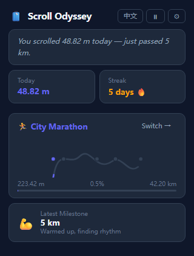

# Scroll Odyssey 🧳

**把你的每次滚动，变成一场真实旅程。**

[](https://github.com/zhouder/scroll-odyssey) [](https://opensource.org/licenses/MIT)

---

> ⚡ **30 秒安装** — [Chrome 网上应用店](#安装) (即将上线) · [下载 ZIP](#安装) · [从源码构建](#从源码构建)

---

把你每天的网页滚动变成一段真实世界旅程。走完长城、环台湾骑行、穿越撒哈拉。一次网页滚动一步。



<!-- TODO: add demo gif showing extension in action -->

## 为什么值得关注

大多数人在不知不觉中每天滚动数千像素——这些距离足以完成一次阿巴拉契亚山径徒步、丝绸之路探险，或绕东京 10 圈。Scroll Odyssey 将这份隐形的努力转化为真实路线的可见进度，配有里程碑和可分享的旅行明信片。

- 🌍 **10 条真实路线** — 城市马拉松、长城徒步、东京漫步、巴黎漫步、丝绸之路、台湾环岛、圣地亚哥之路、阿巴拉契亚山径、撒哈拉穿越、北京胡同漫游
- 🏆 **里程碑解锁** — 到达关键地点时自动解锁命名检查点
- 🖼️ **旅行明信片 PNG** — 生成并分享你的旅程
- 📊 **7 天趋势图** — 一眼看清滚动历史
- 🔥 **连续天数** — 每日连续记录追踪
- 🌏 **双语支持** — English / 中文（设置中切换）
- 🔒 **100% 离线** — 无服务器、无账号、零埋点

## 安装

### 🛒 Chrome 网上应用店
> **即将上线** — 审核通过后即可在此找到。

### 📦 从 GitHub Releases 下载
> **即将上线** — 发布 release 后，可从 [Releases 页面](https://github.com/zhouder/scroll-odyssey/releases) 获取 `.zip` 文件并加载到 Chrome。

### 🔧 从源码构建

```bash
git clone https://github.com/zhouder/scroll-odyssey
cd scroll-odyssey
npm install
npm run build
```

1. 打开 `chrome://extensions/`（或 `edge://extensions/`）
2. 开启右上角**开发者模式**
3. 点击**加载已解压的扩展程序** → 选择 `dist/` 目录

## 使用

- **滚动任意网页** — 工具栏徽章显示今日公里数
- **点击图标** — 查看今日叙事和路线进度
- **点击 ⚙** — 打开仪表盘（总览 / 路线 / 明信片 / 设置）

## 隐私承诺

你的数据只存在你自己的设备上。

| | |
|---|---|
| ✅ | 仅保存**距离数字和日期** — 绝不保存页面 URL 或内容 |
| ✅ | 域名统计**默认关闭**；可从设置中手动开启 |
| ✅ | **零网络请求** — 数据永不离开你的浏览器 |
| ✅ | **一键清空** — 设置页 → 清空所有数据 |
| ✅ | 自动跳过 `chrome://`、`edge://` 及扩展页面 |

所有数据仅存储在本机的 `chrome.storage.local` 中。

## 距离换算

> 1 像素 ≈ 0.2646 mm（96 DPI 标准）→ 1 米 ≈ 3780 像素

实际值受屏幕 DPI 和系统缩放影响，此为合理估算值。

## 开发

```bash
npm test        # 单元测试（vitest）
npm run lint    # ESLint
npm run build   # 输出到 dist/
```

## 分享与传播

### GitHub Topics（在仓库设置中添加）

```
chrome-extension  browser-extension  productivity  quantified-self
digital-wellbeing  gamification  scroll-tracker  react  vite
typescript  privacy-first  offline-first
```

### 社交预览图（1280 × 640 px）

建议文案（用于制作 `social_preview.png`）：

```
Scroll Odyssey
把滚动变成一场旅程
走完长城，穿越撒哈拉
一次网页，一步世界。
```

## 许可证

MIT
